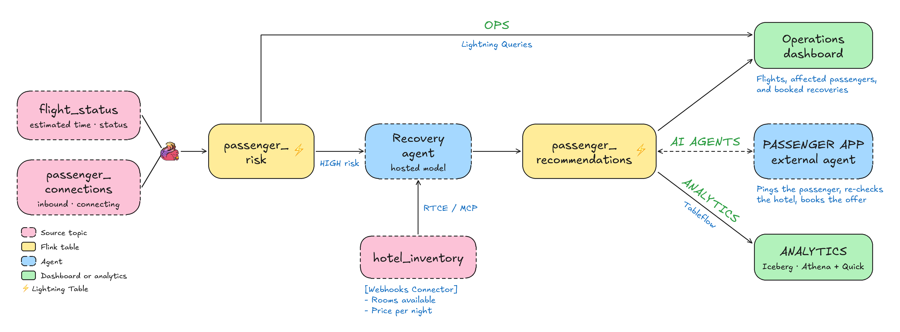

# Streamhouse Flight Recovery Demo



> **Keynote demo:** The [keynote data schema](./docs/keynote-data-gen-schemas-erd.md) defines the new flight, passenger, and hotel feeds. The SQL, generator, and app now implement live connection risk and two offers. The [older data model](./docs/data-model.md) documents the legacy pipeline that still exists in this deployment. The hosted agent, webhook connector, and S3/Glue/Athena history scene remain to be built.

An inbound flight slips, putting 200 synthetic connecting passengers at risk. Flink maintains `passenger_risk` and counts affected passengers in `flight_impact`. A small app shows two recovery offers for each passenger and checks hotel availability before booking.

- **an operations app** through [Lightning Tables](https://docs.confluent.io/cloud/current/lightning/overview.html)
- **AI agents** through a [Streaming Agent](https://docs.confluent.io/cloud/current/ai/streaming-agents/overview.html) and the [Real-Time Context Engine](https://docs.confluent.io/cloud/current/ai/real-time-context-engine/overview.html) (MCP)
- **open analytics** through [Tableflow](https://docs.confluent.io/cloud/current/topics/tableflow/overview.html) (Iceberg in this deployment)

## Quickstart

Prerequisites: `uv`, `terraform`, the Confluent CLI, and a Confluent Cloud account. The full setup is in the [walkthrough](./docs/walkthrough.md#prerequisites).

```bash
uv run deploy
```

That's it. Deploy asks for your Confluent Cloud login and API key, provisions everything, publishes the demo data, enables Lightning Tables and RTCE, and offers to start the app at http://127.0.0.1:8000. Later, `uv run airport-app` restarts the app.

`uv run destroy` tears everything down. Replaying the data, running single scenes, troubleshooting, and reset are in the [walkthrough](./docs/walkthrough.md).

## The app

`uv run airport-app` serves the keynote FastAPI app:

- **Operations:** live flights and the Flink-computed affected count.
- **Passenger:** two offers, a select action, hotel substitution when a room sells out, and booking.

The browser polls every 2.5 seconds. Lightning credentials stay server-side. The generator publishes offers deterministically; it does not yet claim that a hosted model or external agent generated them. Hotel changes currently publish directly to Kafka because no Webhooks source connector is deployed.

## Repository layout

| Path | What's there |
|---|---|
| [`scripts/`](./scripts/) | Deploy/destroy, RTCE setup, keynote generator and app (`keynote_datagen.py`, `keynote_app.py`); older app and generator remain for the legacy pipeline |
| [`terraform/core/`](./terraform/core/) | Environment, Kafka cluster, Flink compute pool, service accounts, keys |
| [`terraform/airline-demo/`](./terraform/airline-demo/) | The demo pipeline. The Flink SQL in [`sql/`](./terraform/airline-demo/sql/) is the source of truth |
| [`tests/`](./tests/) | `uv run pytest` and `node --test tests/test-app-pivot.js` |
| [`docs/`](./docs/) | Walkthrough, legacy data model, and keynote data contract |

Contributors and AI coding agents should read [AGENTS.md](./AGENTS.md).

All data is synthetic. Never commit `credentials.env`.

Licensed under Apache 2.0. See [LICENSE](./LICENSE) and [CHANGELOG.md](./CHANGELOG.md).
