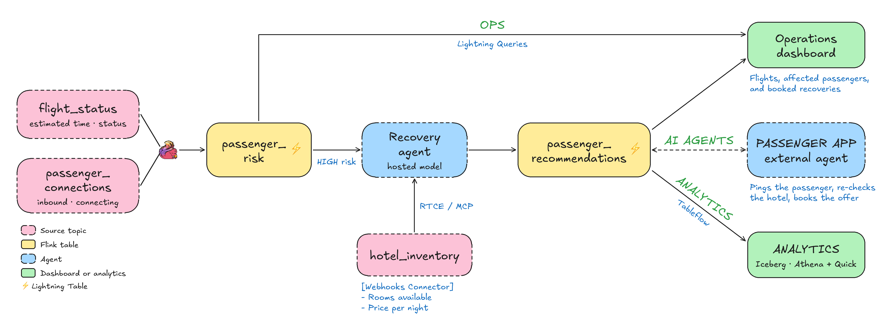

# Streamhouse Flight Recovery Demo



River Air runs 180 flights a day through SFO. When flight RA417 from Chicago slips by nearly two hours, 150 of its passengers miss their connections. Flink recomputes every connection as flight updates arrive, maintains `passenger_state` and `flight_impact`, and each at-risk passenger gets two rebooking offers, with a hotel when the wait is overnight. Thirty days of history answer the closing questions in Athena: how many flights were delayed, how many passengers were impacted, what it cost, and how long recovery takes. The [data model](./docs/data-model.md) defines every feed and field.

- **an operations app** through [Lightning Tables](https://docs.confluent.io/cloud/current/lightning/overview.html)
- **AI agents** through the [Real-Time Context Engine](https://docs.confluent.io/cloud/current/ai/real-time-context-engine/overview.html) (MCP)
- **open analytics** through [Tableflow](https://docs.confluent.io/cloud/current/topics/tableflow/overview.html) to Iceberg in S3 with AWS Glue and Athena

## Quickstart

Prerequisites: `uv`, `terraform`, the Confluent CLI, and a Confluent Cloud account. The full setup is in the [walkthrough](./docs/walkthrough.md#prerequisites).

```bash
uv run deploy
```

That's it. Deploy asks for your Confluent Cloud login and API key, provisions everything, publishes 30 days of history and today's flights, starts a 90-minute live stream in the background, enables Lightning Tables and RTCE, and offers to start the app at http://127.0.0.1:8000. Later, `uv run airport-app` restarts the app and `uv run airport-datagen` restarts the scene.

`uv run destroy` tears everything down. Replaying the data, running single scenes, troubleshooting, and reset are in the [walkthrough](./docs/walkthrough.md).

## The app

`uv run airport-app` serves the FastAPI app:

- **Operations:** today's 180 flights with delay and passengers at risk, the biggest delays, and a drill-down into each flight's passengers.
- **Passenger:** two offers, live hotel options in place of the biggest delays, a select action, a replacement hotel offer when the chosen room has sold out, and booking.

The browser polls every 2.5 seconds. Lightning credentials stay server-side. With AWS credentials, a recovery agent (Claude on Amazon Bedrock, reading RTCE/MCP) writes the live day's offers for RA417; the generator writes every other flight's, and all of them without AWS credentials. Hotel changes publish directly to Kafka because no Webhooks source connector is deployed yet.

## Repository layout

| Path | What's there |
|---|---|
| [`scripts/`](./scripts/) | Deploy/destroy, RTCE setup, the generator (`airport_datagen.py`), and the app (`airport_app.py`) |
| [`terraform/core/`](./terraform/core/) | Environment, Kafka cluster, Flink compute pool, service accounts, keys |
| [`terraform/airline-demo/`](./terraform/airline-demo/) | The demo pipeline. The Flink SQL in [`sql/`](./terraform/airline-demo/sql/) is the source of truth |
| [`tests/`](./tests/) | `uv run pytest` |
| [`docs/`](./docs/) | Walkthrough, data model, and architecture diagram |

Contributors and AI coding agents should read [AGENTS.md](./AGENTS.md).

All data is synthetic. Never commit `credentials.env`.

Licensed under Apache 2.0. See [LICENSE](./LICENSE) and [CHANGELOG.md](./CHANGELOG.md).
