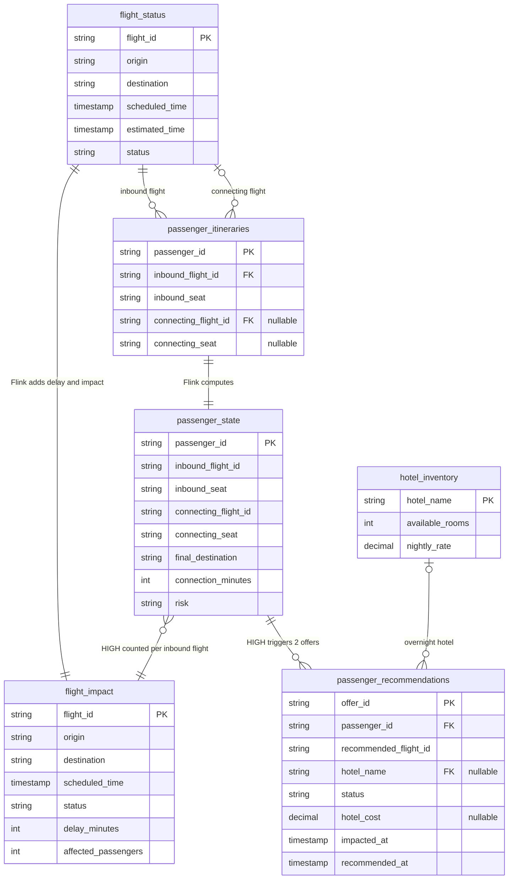

# River Air flight recovery: data model, generator, and ERD

**Status:** Data contract as of 2026-09-30. It matches the Flink SQL in [`terraform/airline-demo/sql/`](../terraform/airline-demo/sql/) (files 20–30) and [`airport_datagen.py`](../scripts/airport_datagen.py). The Webhooks source connector is still planned, so the generator publishes hotel updates directly to Kafka.

## Work backwards from the questions

Demo 3 asks two historical questions in Athena or Amazon Quick:

1. *How many flights were delayed in the last 30 days? How many passengers were impacted, and how much did it cost us?*
2. *What's the average time it takes to recover an impacted passenger?*

Every source field, Flink column, and generator rule below exists to answer those questions, or to show the live scenes that lead up to them.

| Answer | Table (Iceberg via Tableflow) | Definition |
| --- | --- | --- |
| Delayed flights | `flight_impact` | `delay_minutes >= 15` |
| Impacted passengers | `flight_impact` | `sum(affected_passengers)`: passengers whose connection became HIGH risk |
| Cost | `passenger_recommendations` | `sum(hotel_cost)` of `BOOKED` offers. This is hotel spend only; unselected offers never count |
| Recovery time | `passenger_recommendations` | `avg(recommended_at - impacted_at)` over `BOOKED` offers |

Recovery time runs from the moment a connection became HIGH risk (`impacted_at`) to the moment the recovery offer was ready (`recommended_at`). It deliberately excludes the customer's decision time: a passenger who waits an hour to tap **Book** does not make River Air look an hour slow.

"Last 30 days" is a trailing window: `scheduled_time >= current_date - INTERVAL '30' DAY` for flights and `recommended_at >= current_date - INTERVAL '30' DAY` for cost.

```sql
-- Athena, over the Glue database Tableflow syncs into
SELECT count_if(delay_minutes >= 15) AS delayed_flights,
       sum(affected_passengers)      AS impacted_passengers
FROM flight_impact
WHERE scheduled_time >= current_date - INTERVAL '30' DAY;

SELECT sum(hotel_cost)                                                    AS hotel_cost,
       avg(to_unixtime(recommended_at) - to_unixtime(impacted_at))        AS avg_recovery_seconds
FROM passenger_recommendations
WHERE status = 'BOOKED' AND recommended_at >= current_date - INTERVAL '30' DAY;
```

With the default seed, the generator produces roughly 1,600 delayed flights, 8,600 impacted passengers, about $550,000 of hotel spend, and an average recovery time of about 23 seconds for the trailing 30 days.

## Source topics

Three source feeds carry the facts shown on screen. The deployed Flink tables call each business ID column `key` because of the raw-key Kafka convention; it is the `flight_id`, `passenger_id`, `hotel_name`, or `offer_id` for that table. All IDs and events are synthetic.

### `flight_status` (6 columns)

| Column | Type | Purpose |
| --- | --- | --- |
| `flight_id` | STRING, key | One dated flight, for example `RA417-20260928`. |
| `origin` | STRING | Route shown on screen. |
| `destination` | STRING | Route shown on screen. |
| `scheduled_time` | TIMESTAMP | Baseline for delay. |
| `estimated_time` | TIMESTAMP | Latest estimate, used for delay and connection time. |
| `status` | STRING | `ON_TIME`, `DELAYED`, `BOARDING`, `DEPARTED`, or `LANDED`. |

Every flight either arrives at or leaves the SFO hub, never both. For an arrival, the two times mean arrival at SFO; for a departure, they mean departure from SFO.

### `passenger_itineraries` (5 columns)

| Column | Type | Purpose |
| --- | --- | --- |
| `passenger_id` | STRING, key | Synthetic ID, for example `P-0928-417-001`. |
| `inbound_flight_id` | STRING | The arrival into SFO. |
| `inbound_seat` | STRING | The passenger's seat on the inbound flight, for example `19F`, from the [one seat map](#generator) every flight uses. |
| `connecting_flight_id` | STRING, nullable | The departure the passenger must catch. Null when the trip ends at SFO. |
| `connecting_seat` | STRING, nullable | The passenger's seat on the connecting flight. Null when the trip ends at SFO. |

No names, contact details, or preferences: the join and the risk rule don't need them, and the seats only place the passenger on each flight's seat map.

### `hotel_inventory` (3 columns)

| Column | Type | Purpose |
| --- | --- | --- |
| `hotel_name` | STRING, key | `Harbor Hotel` or `Park Hotel`, both near SFO. |
| `available_rooms` | INT | Zero forces a different choice. |
| `nightly_rate` | DECIMAL(10,2) | $189 and $219; the hotel cost of an overnight rebooking. |

## Computed data products

| Topic | Key | Columns | Producer and use |
| --- | --- | --- | --- |
| `passenger_state` | `passenger_id` | `inbound_flight_id`, `inbound_seat`, `connecting_flight_id`, `connecting_seat`, `final_destination`, `connection_minutes`, `risk` | Flink joins each itinerary to its inbound flight and (left join) its connecting flight, and keeps the itinerary's seats. `risk` is `HIGH` when the estimated connection is under 45 minutes, `OK` otherwise, and `NO_CONNECTION` when the trip ends at SFO. The app's passenger drill-down and the agent trigger read it. |
| `flight_impact` | `flight_id` | `origin`, `destination`, `scheduled_time`, `status`, `delay_minutes`, `affected_passengers` | Flink computes the delay and counts `HIGH` passengers per inbound flight. The operations dashboard takes its at-risk counts from it, and each flight's status and delay from `flight_status`, which reaches Lightning within seconds rather than at Flink's once-a-minute commit. It is also the Iceberg table for question 1. |
| `passenger_recommendations` | `offer_id` | `passenger_id`, `recommended_flight_id`, `hotel_name`, `status`, `hotel_cost`, `impacted_at`, `recommended_at` | Two offers (`{passenger_id}-O1`, `-O2`) per HIGH-risk passenger. `hotel_name` and `hotel_cost` are null for a same-day rebooking and set when the wait is six hours or more. Status moves `OFFERED` → `SELECTED` → `BOOKED`; the other offer becomes `CLOSED`. Offers nobody picks are `CLOSED` after 90 minutes. |

Flink performs every join and aggregation. Lightning Tables only serves current rows, and RTCE/MCP gives a connected agent the same rows.

**Internal staging table.** `passenger_state_changes` (key `passenger_id`; columns `inbound_flight_id`, `connecting_flight_id`, `final_destination`, `risk`) is an append-only copy of every `passenger_state` change, because `AI_RUN_AGENT` can't read an upsert table. `impacted_passengers` (same key; `inbound_flight_id`, `connecting_flight_id`, `final_destination`, `impacted_at`) keeps one row per RA417 passenger, the first time they turn HIGH; that change row's `$rowtime` is `impacted_at`. The agent runs once per final destination and gives every passenger in the group the same two offers. Neither table is a data product or on the architecture diagram.

## ERD



`recommended_flight_id` points back to `flight_status`; the ERD leaves out that arrow to stay readable. The [architecture diagram](./architecture.excalidraw) ([PNG](./architecture.png)) shows the same design at system level.

## Generator

[`airport_datagen.py`](../scripts/airport_datagen.py) runs behind `uv run airport-datagen`. `uv run deploy` publishes the same data and then starts the live stream in the background.

```bash
uv run airport-datagen                 # 30 days of history + today, then stream live updates for 90 minutes
uv run airport-datagen --skip-history  # today only, for a quick rehearsal
uv run airport-datagen --minutes 0     # publish the current state and exit
uv run airport-datagen --dry-run --skip-history --minutes 5   # print JSON, no Kafka, no waiting
uv run airport-datagen --reset         # tombstone every generated key
```

`--seed` (default 42) and `--now` make the data reproducible. The same seed and date always produce the same keys and values. Starting a new stream stops one left running by an earlier deploy or run.

**Each service day** has 180 River Air flights, so one Lightning query (200-row cap) returns a whole day:

- 90 arrivals into SFO from 15 cities between 06:00 and 23:00.
- 90 departures to the same 15 cities, 6 per destination, between 06:30 and 23:30. The last bank (22:10–23:30) has one departure to each city.
- 120–180 passengers per arrival, each in a random seat of its own. About 30% connect onward with 60–180 minutes to spare; the rest end their trip at SFO.
- Delays: about 70% of flights are within 15 minutes of schedule, about 25% are 15–60 minutes late, and 10 a day are 90–240 minutes late.

**One aircraft.** Every River Air flight uses the same seat map, modeled after a two-class Boeing 737-900ER: First in rows 1–5 (seats A, C, D, F) and Economy in rows 6–32 (A–F), 182 seats in all. Each passenger gets a random open seat on their inbound flight and, when they connect, on their departure. A departure seats only its connecting passengers, about 40 on average, because the generator doesn't model trips that start at SFO. Seats are drawn from their own random stream, so they never change delays, connections, or offers.

**Realistic updates.** An active flight publishes its current row once a minute, from three hours before departure or arrival until it has departed or landed. Announced delays only grow, in steps: a severe delay is revealed at about 30%, 65%, then 100% of its final length. Near landing, a severely delayed arrival may make up at most three minutes. Status only moves forward. The generator rejects any connection whose risk would change more than once, so a passenger never flips from HIGH back to OK. During the live stream, en-route arrivals also revise their estimate by a minute or two at most updates, the way arrival-time feeds do, and hold the announced delay again from 10 minutes before landing. A revision never changes a flight's status or map color, or any connection's risk.

**The live day** is shifted so RA417 from Chicago O'Hare is scheduled 50 minutes after the stream starts (template time 21:40). RA417 carries 170 passengers, leaving 12 of its 182 seats open: 150 connect to last-bank departures with 50–110 minutes to spare, and 20 end their trip at SFO. RA417 publishes every 30 seconds, and from +5 to +25 minutes each update adds to its delay, up to 115 minutes. Its passengers turn HIGH one destination at a time, about once a minute from +6 to +16:30, until all 150 are at risk. Those passengers can only be rebooked onto tomorrow morning's flights, so each gets two overnight offers: the first with Harbor Hotel ($189) and the second with Park Hotel ($219). Both hotels publish their rooms every 15 seconds as guests book and cancel: Harbor Hotel drifts down about a room a minute and sells out exactly 40 minutes into the stream, and Park Hotel moves by a room here and there. RA417's offers stay `OFFERED` for the presenter; the app substitutes an available hotel when the chosen one has sold out.

**Offers** follow the recovery agent's rules ([`sql/30`](../terraform/airline-demo/sql/30-agent-passenger-recovery.sql)). On the live day the agent writes RA417's when Bedrock is set up; the generator writes the rest, and all of them without Bedrock. Each HIGH-risk passenger gets two offers 5–40 seconds after the flight update that made the connection HIGH risk. The rebookings are the next two departures to the same destination at least 45 minutes after the passenger's arrival. Earlier today and in history, about 85% of passengers book one offer 3–90 minutes later; the rest let both offers close.

**History** covers the 30 days before today, with the same schedule and time shift. It writes each flight's final row, the connecting passengers (the only ones who can be impacted), and completed offers. Tomorrow's schedule is also published so overnight rebookings point to real flights.

## Cost boundary

With only these sources, the defensible cost answer is **hotel spend on booked offers**, not the total cost of rebooking. Keep the on-screen question specific to hotel cost unless another cost source is approved.
