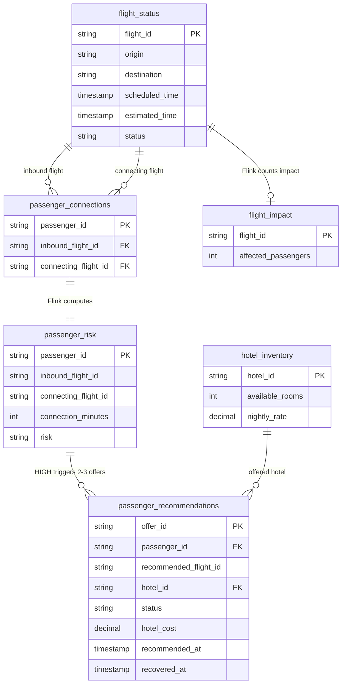

# Keynote demo: data schema, generator, and ERD

**Status:** Keynote data contract, 2026-09-24. The executable SQL is in [`terraform/airline-demo/sql/`](../terraform/airline-demo/sql/), numbered 20–25. The [legacy data model](./data-model.md) still describes the older deployed pipeline. The hosted agent, webhook connector, and S3/Glue/Athena history scene remain planned.

## The smallest useful shape

Three source topics carry the facts used on screen. Flink produces one passenger-risk topic and a two-column dashboard count. The generator writes two offers per affected passenger; a hosted agent is planned for that step. There is no gate, crew, bag, airport, seat-inventory, reservation, or separate rebooking table in this design.

| Source topic | Why it exists | Columns |
| --- | --- | --- |
| `flight_status` | Show the latest flight status and compute both delay and connection time. | 6 |
| `passenger_connections` | Link each synthetic passenger to an inbound and onward flight. The name avoids the deployed seven-column legacy `passenger_itineraries` topic. | 3 |
| `hotel_inventory` | Let the agent see a price and switch hotels when a room sells out. | 3 |

All IDs and events are synthetic. The demo uses one transfer airport. That restriction keeps the source rows small and makes the timing rule unambiguous.

The deployed Flink tables call each business ID column `key` because the existing raw-key Kafka convention requires that name. It represents `flight_id`, `passenger_id`, `hotel_id`, or `offer_id` according to the table; it does not add a column.

## Source schemas

### `flight_status` (6 columns)

| Column | Type | Purpose |
| --- | --- | --- |
| `flight_id` | STRING, key | Stable flight lookup and link from an itinerary. Use a unique ID per dated flight. |
| `origin` | STRING | Route shown in the topic and operations view. |
| `destination` | STRING | Route shown in the topic and operations view. |
| `scheduled_time` | TIMESTAMP | Baseline for delay. |
| `estimated_time` | TIMESTAMP | Current time used in the connection calculation. |
| `status` | STRING | The latest plain-language flight state shown on screen. |

For a flight arriving at the transfer airport, the two time fields mean arrival. For a flight leaving it, they mean departure. The generator does not create a flight that both arrives and departs at the transfer airport. This is a demo convention, not a general flight-operations schema.

### `passenger_connections` (3 columns)

| Column | Type | Purpose |
| --- | --- | --- |
| `passenger_id` | STRING, key | Synthetic passenger identity and drill-down key. |
| `inbound_flight_id` | STRING | Flight whose estimated arrival can change. |
| `connecting_flight_id` | STRING | Flight the passenger needs to catch. |

The app may display the synthetic ID. Names, contact details, ticket class, bags, and passenger preferences add no information needed for the scripted join or risk calculation, so they stay out.

### `hotel_inventory` (3 columns)

| Column | Type | Purpose |
| --- | --- | --- |
| `hotel_id` | STRING, key | Human-readable synthetic hotel name or code. |
| `available_rooms` | INT | A positive count is available; zero forces a new choice. |
| `nightly_rate` | DECIMAL(10,2) | Price shown to the agent and used for the demo's hotel cost. |

All hotels are near the one transfer airport. There is no hotel location column. The planned hotel partner sends keyed updates through the Webhooks source connector. The generator publishes this three-field update directly to Kafka; no connector is deployed.

## Computed data products

These are outputs, not extra source systems. Keep the fields shown below unless a rehearsed screen or query proves another is needed.

| Topic | Key | Columns | Producer and use |
| --- | --- | --- | --- |
| `passenger_risk` | `passenger_id` | `passenger_id`, `inbound_flight_id`, `connecting_flight_id`, `connection_minutes`, `risk` | Flink joins the itinerary to two `flight_status` rows. Proposed demo rule: `HIGH` when the time between estimated arrival and onward departure is under 45 minutes; otherwise `OK`. This is the current view used for passenger drill-down and the agent trigger. |
| `flight_impact` | `flight_id` | `flight_id`, `affected_passengers` | Flink counts `HIGH` passengers by inbound flight before Lightning Tables serves the operations dashboard. Flight delay and status still come from `flight_status`. |
| `passenger_recommendations` | `offer_id` | `offer_id`, `passenger_id`, `recommended_flight_id`, `hotel_id`, `status`, `hotel_cost`, `recommended_at`, `recovered_at` | The keynote generator writes two distinct offers for each affected passenger. The app looks up offers by `passenger_id` and updates the selected `offer_id`. `hotel_cost` is the synthetic room charge; `recovered_at` is empty until booked. The timestamps support the recovery-time question. |

The high-risk change will trigger the planned streaming agent. It is not a fourth source feed. Each offer has a stable `offer_id`, so a passenger can choose one of two current options. The selected offer moves from `OFFERED` to `SELECTED`; if its hotel reaches zero rooms, the app reads fresh hotel context and updates that same offer with an available hotel. The app shows the substitution before booking succeeds. A successful booking moves the selected offer to `BOOKED` and closes the other offer.

The booked offer alone contributes to hotel spend and average recovery time. Do not sum the costs of unselected offers. No additional source or selection table is needed: `offer_id` identifies the user's choice, and `status` records its outcome.

The `flight_impact` topic contains a count, not passenger details. Flink performs the aggregation. Lightning Tables performs the current lookup and scan. The planned agent will read hotel context through RTCE/MCP and use a model hosted in Confluent.

## ERD



`recommended_flight_id` points back to `flight_status`; the ERD leaves out that return arrow to keep the picture readable. The [Excalidraw architecture](./keynote-architecture.excalidraw) and [PNG preview](./keynote-architecture.png) show the same design at the system level.

## Deterministic generator and scene data

[`keynote_datagen.py`](../scripts/keynote_datagen.py) runs behind the existing `uv run airport-datagen` entry point. It follows the lightweight `uv run lab3_datagen` pattern from `quickstart-streaming-agents`: one command reads deployment credentials, creates small synthetic fixtures locally, publishes them, and exits. It uses the existing Terraform-output credential helper and registered value schemas. The legacy [`airport_datagen.py`](../scripts/airport_datagen.py) remains available as a Python module for the older walkthrough.

**Commands:**

```bash
uv run airport-datagen                 # complete, finite demo sequence
uv run airport-datagen --dry-run       # inspect the same sequence without publishing
uv run airport-datagen --phase history # backdate 30 days of analytics-scene data, once, ahead of the show
uv run airport-datagen --reset         # clear the demo data for a fresh run
uv run deploy                          # deploy also runs the same sequence automatically
```

Retain `--seed` and `--now` for reproducible data and a controllable clock. Keep phase selection for capture and reset, but make the no-argument command sufficient for a normal run. Use short, bounded waits between the staged changes so the flight delay and hotel switch remain visible. The process should finish cleanly; it does not need to stay running as a background service.

[`deploy.py`](../scripts/deploy.py) runs the generator after both Terraform roots succeed. It calls the same generator used by `uv run airport-datagen` and waits for the four required value schemas. Re-running deploy replays the incident from the start. The Webhooks source connector is still a future integration; the generator writes the hotel update directly to Kafka.

A full run needs these phases:

1. **Baseline:** write four flight rows, 200 three-field itinerary rows, and two three-field hotel rows. The operations dashboard shows zero affected passengers. Implemented.
2. **Delay:** update the inbound flight's `estimated_time` and `status`. Flink changes `passenger_risk` to `HIGH` and `flight_impact` to 200. Implemented and verified live through Confluent MCP.
3. **Recovery:** the generator writes two offers for each passenger, each with a stable `offer_id`. Agent triggering and RTCE hotel reads remain planned.
4. **Selection and hotel change:** the generator sets the first hotel's availability to zero directly in Kafka. The app checks current hotel rows, substitutes an available hotel, and displays it before booking. The other offer closes after success. The webhook and external agent remain planned.
5. **History fixture:** implemented as an explicit `--phase history` run (not part of the default `all` sequence, since it backdates 30 days of past flights rather than replaying the live incident). It writes dated `HIST-`-prefixed flights and `H-`-prefixed passengers to `flight_status`/`passenger_connections`, which the existing Flink SQL joins into backdated `passenger_risk`/`flight_impact` rows the same way it does for live data, plus already-`BOOKED`/`CLOSED` `passenger_recommendations` rows the generator writes directly (there is no agent yet to produce them). Tableflow still needs `flight_status`, `passenger_risk`, and `passenger_recommendations` synced as Iceberg tables in S3/AWS Glue for the Athena question — that connector/catalog wiring remains planned. Because these are the same compacted "current state" topics the live ops dashboard reads, [`keynote_app.py`](../scripts/keynote_app.py) filters `/api/state` to the live scenario's known flight and passenger IDs so the history volume never leaks into the Demo 1/2 dashboard.

The generator uses stable IDs and a controllable clock so the same seed reproduces the same 200 affected rows, offer IDs, hotel switch, and history fixture. It derives `hotel_cost` from the synthetic hotel rate; the app updates the chosen offer's cost if its hotel changes. `--reset` writes tombstones for the fixture keys, including the history phase. Automated source validation remains to be built.

## Cost boundary

The script asks how much recovery cost. With only the three sources above, the defensible answer is **hotel cost for booked offers**, not the sum of all options or the airline's total cost of rebooking. Keep the on-screen query specific to hotel spend unless another cost source is explicitly approved.
